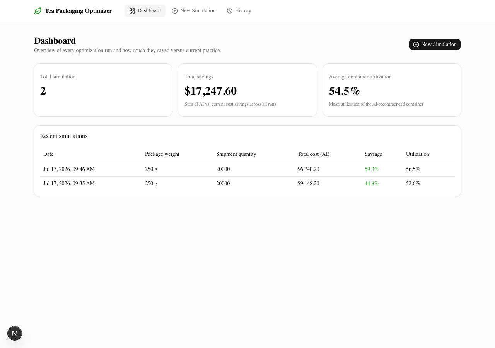
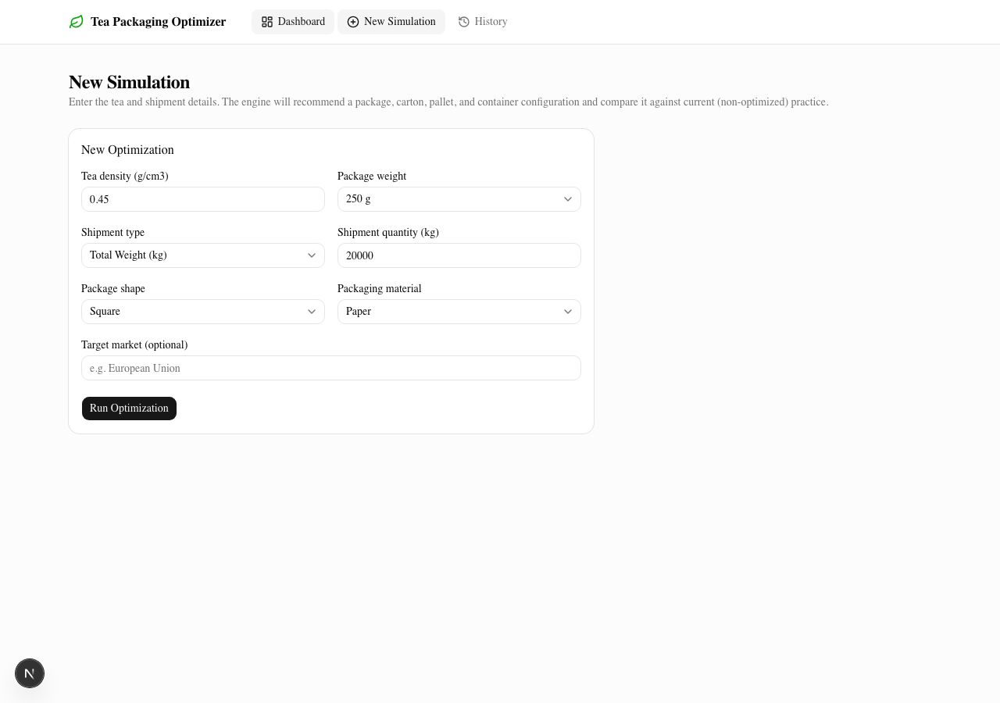
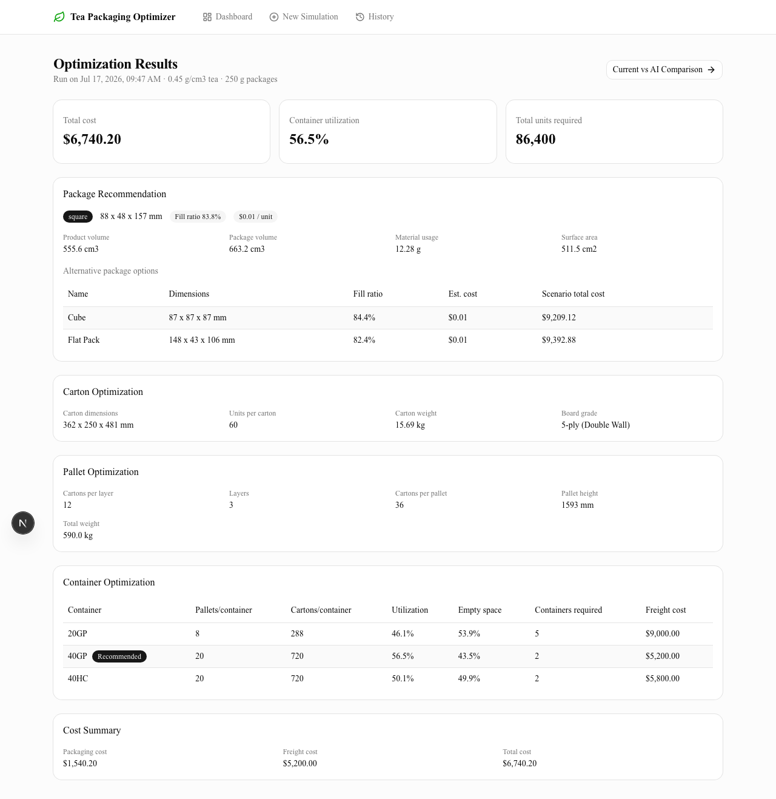
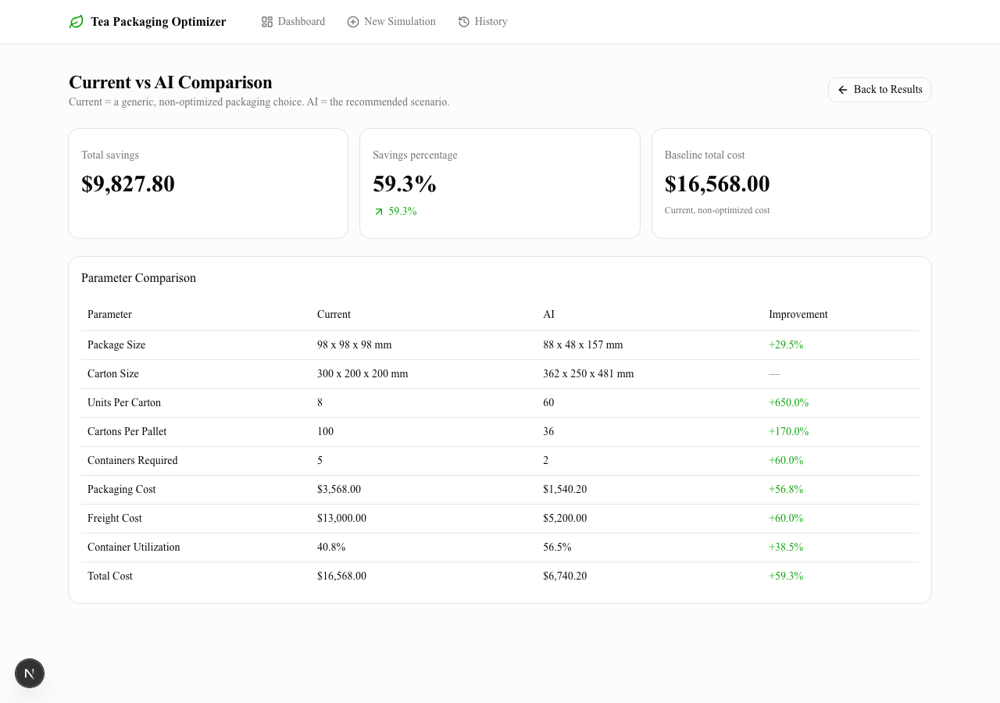
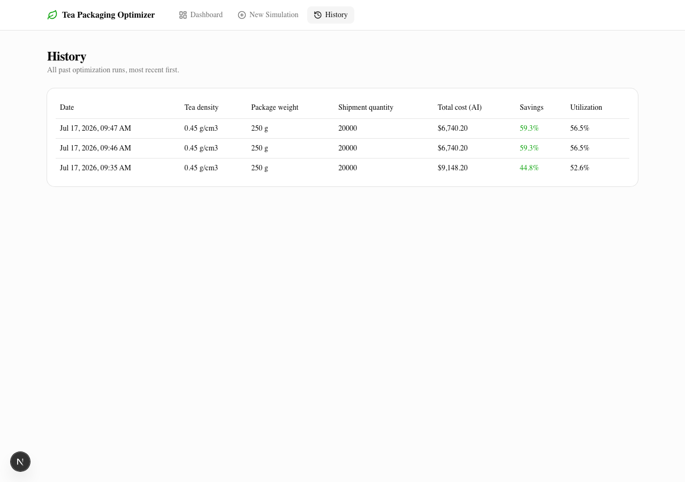

# AI-Powered Tea Packaging Optimization Platform

An AI-assisted system that recommends optimal packaging configurations for tea
exports - inner package, master carton, pallet, and shipping container - and
compares the recommendation against current (non-optimized) practice.

Built for the Innovacio Technologies AI Developer Assessment.

## Contents

- [Screenshots](#screenshots)
- [Architecture](#architecture)
- [Folder Structure](#folder-structure)
- [The AI Logic / Optimization Approach](#the-ai-logic--optimization-approach)
- [Setup Instructions](#setup-instructions)
- [API Documentation](#api-documentation)
- [Database Schema](#database-schema)
- [Testing](#testing)
- [Assumptions](#assumptions)
- [Scope Notes](#scope-notes)

## Screenshots

| Dashboard | New Simulation |
|---|---|
|  |  |

| Results | Current vs AI Comparison |
|---|---|
|  |  |

| History |
|---|
|  |

## Architecture

```
                      ┌─────────────────────────┐
                      │        Frontend         │
                      │  Next.js 16 (App Router) │
                      │  TypeScript + Tailwind   │
                      │       + shadcn/ui        │
                      └────────────┬────────────┘
                                   │ REST / JSON
                                   ▼
                      ┌─────────────────────────┐
                      │        Backend          │
                      │   FastAPI (Python 3.12)  │
                      │  ┌───────────────────┐  │
                      │  │  API layer (v1)   │  │
                      │  ├───────────────────┤  │
                      │  │  Service layer    │  │
                      │  ├───────────────────┤  │
                      │  │ Optimization      │  │  <- pure, framework-agnostic,
                      │  │ engine (pure fns) │  │     unit-tested in isolation
                      │  ├───────────────────┤  │
                      │  │ SQLAlchemy models │  │
                      │  └───────────────────┘  │
                      └────────────┬────────────┘
                                   │
                                   ▼
                      ┌─────────────────────────┐
                      │   PostgreSQL (Alembic    │
                      │      migrations)         │
                      └─────────────────────────┘
```

**Why this layering:** the optimization engine (`backend/app/optimization/`) has
zero dependency on FastAPI, Pydantic, or the database - it operates purely on
plain dataclasses. That is what makes it possible to unit test every
optimization stage (package, carton, pallet, container, full pipeline) in
isolation, and to reuse the exact same code for the granular `/optimize/*`
endpoints and the full `/simulation` pipeline. The service layer
(`app/services/`) is the only place that touches the database, translating
between the pure engine's dataclasses, the API's Pydantic schemas, and the
ORM models.

**Design note - GET reconstructs, doesn't deserialize:** the optimization
engine is a pure function of its four scalar inputs (tea density, package
weight, shipment quantity/type, shape, material). `GET /simulation/{id}`
therefore recomputes the full nested result from those stored inputs rather
than deserializing it back out of the normalized `package_types` /
`cartons` / `pallets` / `containers` tables. Those tables are still
populated on every `POST /simulation` for audit/reporting/export use; the
aggregated `results` row serves the History/Dashboard list views cheaply
without recomputation.

## Folder Structure

```
ai-assessment/
├── docker-compose.yml          # postgres + backend + frontend, one command
├── docs/screenshots/           # UI screenshots for this README
├── backend/
│   ├── app/
│   │   ├── main.py             # FastAPI app, CORS, exception handlers
│   │   ├── core/               # settings (pydantic-settings) + logging config
│   │   ├── optimization/       # the AI Logic engine - pure, framework-agnostic
│   │   │   ├── constants.py    #   all assumption tables (see Assumptions below)
│   │   │   ├── models.py       #   plain dataclasses (SimulationInput, ScenarioResult, ...)
│   │   │   ├── package.py      #   Module 3 - density -> volume -> package candidates
│   │   │   ├── carton.py       #   Module 4 - carton sized around the package
│   │   │   ├── pallet.py       #   Module 5 - pallet loading
│   │   │   ├── container.py    #   Module 6 - 20GP/40GP/40HC comparison
│   │   │   ├── baseline.py     #   the non-optimized "current practice" pipeline
│   │   │   └── pipeline.py     #   orchestrates all stages + Module 7 comparison
│   │   ├── schemas/             # Pydantic request/response models
│   │   ├── services/            # DB persistence + orchestration glue
│   │   ├── models/               # SQLAlchemy ORM models (one file per table group)
│   │   ├── db/                   # engine/session, seed script
│   │   └── api/v1/                # FastAPI routers (the 8 endpoints)
│   ├── alembic/                    # migrations
│   ├── tests/                      # pytest suite for the optimization engine
│   ├── Dockerfile
│   └── requirements.txt
└── frontend/
    ├── src/
    │   ├── app/
    │   │   ├── page.tsx                          # Dashboard
    │   │   ├── simulations/new/page.tsx           # New Simulation form
    │   │   ├── simulations/[id]/page.tsx          # Results
    │   │   ├── simulations/[id]/comparison/page.tsx  # Current vs AI Comparison
    │   │   └── simulations/page.tsx               # History
    │   ├── components/            # nav, stat-card, simulation-form, shadcn/ui primitives
    │   ├── lib/                   # api client, formatters
    │   └── types/                 # TypeScript types mirroring the backend schemas
    └── Dockerfile
```

## The AI Logic / Optimization Approach

Per the brief, this uses **transparent, explainable rule-based optimization
with mathematical formulas** rather than a black-box model (ML is optional
and was not used - every recommendation can be traced to a formula or rule).
The pipeline (see `backend/app/optimization/pipeline.py`):

```
Tea Density ─┐
Package Wt ──┼─► Product Volume ─► Package Candidates ─► Carton ─► Pallet ─► Container
Shipment Qty ┘         │                    │               │         │          │
                        │                    │               │         │          ▼
                        │                    │               │         │   Compare 20GP/40GP/40HC,
                        │                    │               │         │   pick cheapest freight
                        │                    │               ▼         ▼
                        │                    │         Every candidate is carried all the way
                        │                    │         through to a full landed-cost figure
                        │                    ▼
                        │         3 shape-specific aspect-ratio candidates
                        │         (square: cube/standard-pouch/flat-pack;
                        │          round: short-wide/medium/tall)
                        ▼
              volume = package_weight / tea_density
```

1. **Package (Module 3).** `product_volume = package_weight / tea_density`.
   A target fill ratio (0.85, headspace allowance) sizes the pouch/tin
   volume, then 3 named aspect-ratio candidates per shape are solved
   algebraically for their linear dimensions and scored by fill ratio (higher
   is better) with estimated material cost as a tiebreaker.
2. **Carton (Module 4).** Instead of picking from a fixed box catalog, the
   carton is *sized around* the chosen package: every axis-aligned
   orientation (6) and every `(nx, ny, nz)` grid count up to the manual-handling
   dimension (600mm) and weight (20kg) limits is tried, and the orientation
   that packs the most units (by construction, with ~zero wasted volume
   beyond flap padding) wins. Board grade (3/5/7-ply) is picked from a
   contents-weight rule table.
3. **Pallet (Module 5).** Cartons are laid on a standard 1200x1000mm ISO
   pallet footprint, best of two orientations, stacked up to the lower of a
   height limit (1700mm) and a weight limit (1000kg).
4. **Container (Module 6).** 20GP / 40GP / 40HC are each evaluated: pallets
   per container (floor-space + payload-weight limited), utilization, and
   freight cost for however many containers the shipment requires. The
   cheapest option is recommended; the other two are returned as
   alternatives.
5. **Compare scenarios, recommend lowest cost.** Every package candidate
   from step 1 is carried through steps 2-4 to a full landed cost
   (packaging material + freight). The scenario with the lowest total cost
   is the recommendation - not simply whichever package had the best fill
   ratio in isolation.
6. **Current vs AI (Module 7).** A parallel, deliberately non-optimized
   "baseline" pipeline (`baseline.py`) mirrors the same four stages using
   the simplifying choices a manual planner typically makes today (a plain
   cube pouch with a low 0.60 fill ratio, an off-the-shelf carton picked
   from a small catalog at ~70% packing efficiency, a fixed 5-layer pallet
   rule of thumb, and a default 40GP container). The two are diffed
   parameter-by-parameter into the comparison table, with the improvement
   percentage's sign convention chosen per parameter (lower is better for
   costs/container count, higher is better for utilization/units-per-carton).

All of the numeric assumptions behind these formulas (fill ratio target,
material costs, container dimensions, freight rates, handling limits, etc.)
live in one place - `backend/app/optimization/constants.py` - each with a
comment explaining its reasoning, so they can be swapped for a real client's
numbers without touching the algorithm.

## Setup Instructions

### Option A: Docker Compose (recommended, one command)

Requires Docker Desktop (or another Docker Engine).

```bash
docker compose up --build
```

This starts Postgres, runs Alembic migrations, seeds reference data, and
starts the backend (`:8000`) and frontend (`:3000`). Open
**http://localhost:3000**.

### Option B: Run locally

**Backend** (requires Python 3.12+ and a running PostgreSQL instance):

```bash
cd backend
python3 -m venv .venv && source .venv/bin/activate
pip install -r requirements.txt

cp .env.example .env   # edit DATABASE_URL if your Postgres differs

alembic upgrade head
python -m app.db.seed

uvicorn app.main:app --reload --port 8000
```

API docs: http://localhost:8000/docs (Swagger) or `/redoc`.

**Frontend** (requires Node 20+):

```bash
cd frontend
npm install
cp .env.local.example .env.local   # points at http://localhost:8000/api/v1
npm run dev
```

Open http://localhost:3000.

### Running tests

```bash
cd backend
source .venv/bin/activate
pytest -v
```

26 tests cover every optimization stage (package, carton, pallet, container,
and the full pipeline) with physics/consistency assertions (fill ratios in
(0,1], handling-weight limits respected, lowest-freight container chosen,
lowest-cost scenario recommended, etc.) - see `backend/tests/`.

## API Documentation

Full interactive docs are auto-generated by FastAPI at `/docs` (Swagger UI)
and `/redoc` once the backend is running. Summary of the 8 required
endpoints plus a bonus dashboard aggregate:

| Method | Path | Purpose |
|---|---|---|
| `POST` | `/api/v1/simulation` | Run the full pipeline (Modules 2-7) and **persist** it |
| `GET` | `/api/v1/simulation` | List past simulations (History), most recent first |
| `GET` | `/api/v1/simulation/{id}` | Fetch one simulation's full result |
| `POST` | `/api/v1/compare` | Run the pipeline and return **only** the Current-vs-AI table, without persisting |
| `POST` | `/api/v1/optimize/package` | Module 3 in isolation |
| `POST` | `/api/v1/optimize/carton` | Module 4 in isolation |
| `POST` | `/api/v1/optimize/pallet` | Module 5 in isolation |
| `POST` | `/api/v1/optimize/container` | Module 6 in isolation |
| `GET` | `/api/v1/dashboard/summary` | Aggregate stats for the Dashboard page (not in the minimum list, added for Module 1) |

Example - create a simulation:

```bash
curl -X POST http://localhost:8000/api/v1/simulation \
  -H 'Content-Type: application/json' \
  -d '{
    "tea_density_g_cm3": 0.45,
    "package_weight_g": 250,
    "shipment_quantity": 20000,
    "shipment_type": "total_weight",
    "package_shape": "square",
    "packaging_material": "paper"
  }'
```

Validation errors return `422` with field-level detail (Pydantic); not-found
returns `404`; unexpected server errors return `500` and are logged
server-side without leaking internals to the client.

## Database Schema

PostgreSQL via SQLAlchemy 2.0 + Alembic migrations (`backend/alembic/versions/`).

| Table | Purpose |
|---|---|
| `users` | Registered user (auth not implemented in this scope, but simulations are owned by a nullable `user_id` from day one) |
| `tea_density_profiles` | Lookup of common tea types -> typical density, a convenience layer over the raw density input |
| `packaging_materials` | Lookup of material cost/thickness/density assumptions, editable without a deploy |
| `simulations` | One "New Optimization" run - the raw Module 2 inputs |
| `package_types` | Every package candidate produced for a simulation (baseline + AI best + alternatives) |
| `cartons` | Carton result per candidate |
| `pallets` | Pallet result per candidate |
| `containers` | Container result per candidate, flagged `is_recommended` |
| `results` | The aggregated Module 7 comparison + summary stats, for cheap Dashboard/History reads |

## Assumptions

Business requirements did not specify real cost/rate figures, so illustrative
industry-typical constants are used throughout and isolated in
`backend/app/optimization/constants.py` for easy replacement:

- **Units:** lengths in mm, package weight in grams, carton/pallet/container
  weights in kg, currency in USD.
- **Target fill ratio** for AI-optimized packages: 0.85 (loose tea needs
  headspace for sealing/settling). Baseline/current uses 0.60 to represent a
  generic, non-optimized pouch.
- **Package weight dropdown:** 50 / 100 / 125 / 250 / 500 / 1000 g.
- **Manual-handling limits:** carton max dimension 600mm, max gross weight
  20kg (a single-person-lift convention), with an 8% weight-budget margin
  reserved for board tare so the final gross weight doesn't creep over the
  limit.
- **Pallet:** ISO 1200x1000mm footprint, 150mm pallet base height, max
  stack height 1700mm, max gross weight 1000kg.
- **Containers:** standard internal dimensions and payload limits for
  20GP / 40GP / 40HC; freight cost per container is a flat illustrative
  rate (not a real carrier quote - swap in client rate-card figures for
  production use).
- **Board grade:** selected from contents weight via a simple 3-tier rule
  (3-ply / 5-ply / 7-ply), each with an assumed grammage used to estimate
  carton tare weight from its exterior surface area.
- **"Current" baseline** represents a plausible non-optimized manual
  process (generic cube pouch, off-the-shelf carton catalog, fixed 5-layer
  pallet stacking, default 40GP container) - it is a reference point for
  the improvement comparison, not a specific real client's current process.
- **Target Market** is accepted and stored but does not currently affect the
  optimization math (no client-specific market/compliance rules were
  supplied); it's there for future rules (e.g. labeling-driven package
  minimums) without a schema change.
- **Auth** is not implemented (out of scope per the "core" priority for this
  submission); the schema supports it (`users.id` as a nullable FK) so it
  can be added without migrating existing data.

## Scope Notes

Given the assessment's time budget, this submission prioritizes a complete,
correct, well-tested implementation of every required module and endpoint,
clean layering, and a working Docker Compose stack, over building every
bonus feature. Implemented: Docker Compose, Swagger/OpenAPI docs (auto-
generated), a pytest suite for the optimization engine, and a responsive
modern UI. Not implemented: authentication, CI/CD, an AI chat assistant, 3D
container visualization, and PDF/Excel export - these were deprioritized in
favor of the core AI Logic and full module/endpoint coverage, which the
evaluation criteria weight most heavily (AI/Optimization Logic is 25%,
the single largest category).
